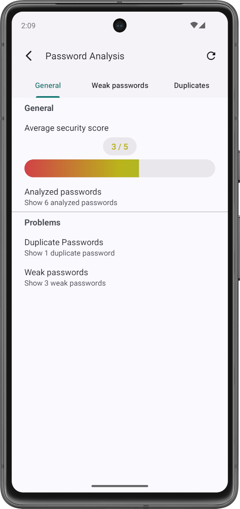

# Password Vault

Are you tired of managing all your account data? Password Vault stores your most sensitive account data like passwords or e-mail addresses with the highest industrial encryption standards on your device locally.

    
    
    

###### Table of Contents
1. [Description](#description)
2. [Install and Use the Project](#install-and-use-the-project)
3. [Contributors](#contributors)
4. [License](#license)
5. [How to contribute](#how-to-contribute)

 

## Description
Password Vault allows you to securely store your most sensitive account data on your device locally. You can add as many accounts to the app as you wish. Each account can contain as many details as you like, such as passwords, e-mail addresses, security questions, etc.

###### Used Technologies
The application is developed with Android Views and Java through the Android Studio IDE. Therefore, the app is built using Gradle.

The app uses Google's Material Design to implement a comfortable and visually pleasing design, that users can intuitively work with.

Furthermore, all data is encrypted through the Advanced Encryption Standard (AES) with Galois / Counter Mode (GCM) with a key size of 256 bits.

###### Miscellaneous
The version numbers for this project are determined based on the guidelines provided by [semver](https://semver.org/).

The project contains a [changelog](CHANGELOG.md) which documents all changes that were made to the application in between software versions.

The app implements multiple frameworks that are reused multiple times within the app. An API documentation for these frameworks can be found [here](docs/development/api/README.md).

 

## Install and Use the Project

###### Install the App
If you want to use the app, you can download the APK file [here](https://github.com/Christian-2003/password-vault/releases/latest). For further details about the installation as well as system requirements, take a look at the [installation guide](docs/manual/Install%20and%20Run%20the%20App.md).

Information about app updates can be found in the installation guide as well. Keep in mind that updating from version 3.1.0 or lower requries special attention as described [here](docs/manual/Update%20to%20Version%203.2.0.md).

Steps to build and run the project through the Android Studio IDE are covered within the installation guide as well: [Cloning This Repository](docs/manual/Install%20and%20Run%20the%20App.md#cloning-this-repository).

###### How to Use the Application
A detailed quickstart guide can be found [here](https://passwordvault.christian2003.de/en/blog/quickstart/). This guide covers all steps to add a new account to the app.

 

## Contributors
Currently, I ([Christian-2003](https://github.com/Christian-2003)) am the only developer.

 

## License
The project is licensed under the terms and conditions of the MIT license. You can view a copy of the license [here](https://github.com/Christian-2003/password-vault/blob/master/LICENSE.txt).

 

## How to Contribute
If you want to contribute to this project, feel free to do so.

Feel free to open issues, for anything you feel is appropriate. If you want to report bugs, please provide steps to reproduce the bug.

If you want to contribute to the code development, be a self respecting person and use the coding guidelines for Java that are taught in school and university.

A few guides for development-purposes are published [here](docs/development/). If you are interested in contributing, this would be a good start.

The project will be developed in English.

 

***
2025-01-12  
&copy; Christian-2003
