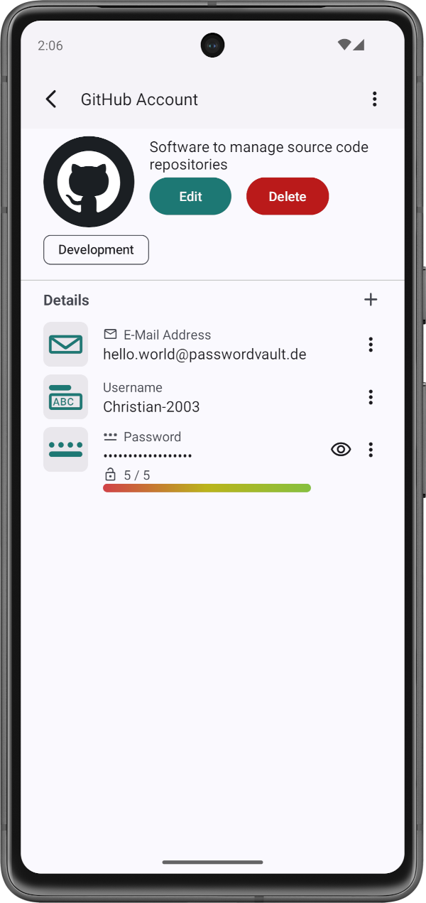

# PasswordVault
The PasswordVault is an application for Android which allows the user to manage account data.

    
    

### Table of Contents
1. [Description](#description)
2. [How to install and run the project](#how-to-install-and-run-the-project)
3. [How to use the application](#how-to-use-the-application)
4. [Contributors](#contributors)
5. [License](#license)
6. [How to contribute](#how-to-contribute)

 

***
## Description
### Functionalities
The application allows the user to create account entries which can store account information about a specific account. Each account entry itself can store any number of account detail information, such as passwords, e-mail addresses, URLs, etc.

### Used Technologies
The application was developed with Java through the Android Studio IDE. The project is build using Gradle.

The version numbers for this project are determined based on the guidelines provided by [semver](https://semver.org/).

### Miscellaneous
The project contains a [changelog](CHANGELOG.md) which documents all changes that were made to the application in between software versions.

Furthermore, a [wishlist](WISHLIST.md) contains a list of all known bugs, all knwon uses of deprecated functionalities, as well as a list of features that shall be added in the future.

 

***
## How to Install and Run the Project
If you want to use this project, there are two ways you can do this.

Please note that the minimum required version for Android is Android 12 (SDK 31).

### Install the release APK
If you want to install the application on your Android device, you can follow these steps:
1. Download the newest release from [here](https://github.com/Christian-2003/password-vault/releases).
2. Move the downloaded APK file to your Android device.
3. Open the filesystem on your Android Device and locate the previously downloaded APK file.
4. Execute the APK file.
5. The application should now be installed.

### Build and Run this Repository
If you prefer to install the application through this repository, you may follow these steps:
1. Download this repository or clone using `git clone https://github.com/Christian-2003/password-vault`.
2. Open the project with the Android Studio IDE.
3. Now you can build and run the project either on an emulator or an Android debugging device that is connected to your computer.

Please note that the repository may contain features that might be changed or removed for the next release.

 

***
## How to Use the Application
If you open the application, you are presented the home screen (currently empty). You can move to the "Accounts"-page through the navigation bar at the bottom. There you will see all your created accounts.

If you click the floating action button "+", you can create a new account. Provide a name and a description. You can click the "Add Detail" button in order to add a new login detail. This opens a dialog window where you can enter a name and the content for the detail. You may choose the display type (i.e. Password or Text) below. Choose the "Obfuscated" setting to obfuscate the content later. Unchoose the "Visible" setting to make the detail not visible. Afterwards, you can click "Save" to save the detail.

The detail should now be displayed. You can add as many details as you want.

Click "Save" to save your account. Now your account should be displayed on the "Accounts"-page. If you click on the previously created account, you can view your account details. If you click "Edit", you may edit your account.

 

***
## Contributors
Currently, I ([Christian-2003](https://github.com/Christian-2003)) am the only developer.

 

***
## License
The project is licensed under the terms and conditions of the MIT license. You can view a copy of the license [here](https://github.com/Christian-2003/password-vault/blob/master/LICENSE.txt).

 

***
## How to Contribute
If you want to contribute to this project, feel free to do so.

Feel free to open issues, for anything you feel is appropriate. If you want to report bugs, please provide steps to reproduce the bug.

If you want to contribute to the code development, be a self respecting person and use the coding guidelines for Java that are taught in school and university.

The project will be developed in English.
