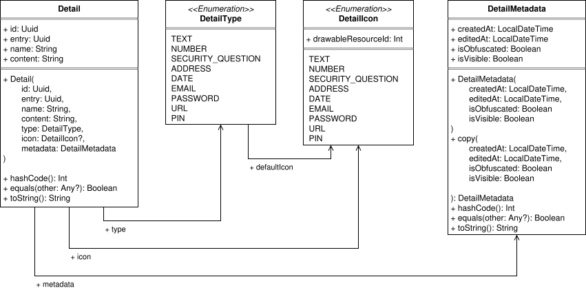

# Architecture
This document describes the architecture of the app Password Vault.

###### Table of Contents
1. [Domain Driven Design](#domain-driven-design)

 

## Domain Driven Design
The app utilizes the principle of Domain Driven Design (DDD) to ensure high quality and good maintainability within the core business logic.

###### Ubiquitous Language
The ubiquitous language (UL) of the domain model consists of the following terms:

Term | Description
--- | ---
User | A user is a person that uses the app. Users want to store account data locally on their Android device.
Entry | An entry stores all data for an account. Therefore, each account has exactly one enrtry. This entry stores basic information about the account, such as it's name and description. Account details, such as email addresses, passwords, pins, addresses, etc. are not part of this entry. Accounts can store an unlimited number of account details, tags and targets.
Detail | A detail stores a specific account information, such as an email address, password, pin, address etc. Each detail is assigned to exactly one entry.
Tag | A tag can be used to group and categorize entries. Tags might be "Work", "Private", "Finance", "Government", "University" and so on. An unlimited number of tags can be assigned to each entry in order to group and categorize them.
Target | A target describes the origin of an account. In other words: This is the target for autofill operations. Each target describes either a website or Android app, for which to provide autofill services. A target is assigned to exactly one entry. However, entries can have multiple targets.

By design, there are relations between the terms of the UL. These relations can be described as follows:

> [!NOTE]
> Add UL relations later

###### Implementation of Domain Logic
> [!NOTE]
> Add implementation of domain logic later

 

## Domain Layer
The domain layer has multiple entities and value objects that are relevant to the app.

###### Entry
Entries have the following attributes:

Attribute | Type | Description and rules
--- | --- | ---
`id` | `Uuid` | Type 4 UUID identifies the entry.
`name` | `String` | The name is displayed to the user. The user can identify an entry by it's name. It is recommended that names are short, even though this is not enforced. Examples for names might be "GitHub Account", "Microsoft" or "My Google Account". This name must not be empty or blank.
`description` | `String` | The description is displayed to the user. The user can use the description for further details regarding the entry. For example, if the user has two GitHub accounts, they can be differentiated through their descriptions: "Private GitHub account" and "My GitHub account for work". Even if this differentiation is not required, descriptions can be used to provide additional context. For example, if an account is named "UPS", the description might be "Deliivery service", which provides additional context and information about the account. A description is optional and can be empty. If a blank description should be stored (e.g. "&nbsp;&nbsp;&nbsp;"), the entry automatically converts this to an empty string.
`created` | `LocalDateTime` | Stores the date time on which the entry was created by the user. This information is not displayed to the user. Instead, it is used for statistical purposes and queries.
`edited` | `LocalDateTime` | Stores the date time on which the entry was edited by the user. This information is not displayed to the user. Instead, it is used for statistical purposes and queries. Whenever any property of the entry changes, this value is automatically updated to `LocalDateTime.now()` This date time must not be before `created`.
`tags` | `List<Tag>` | Stores the list of tags that are associated with the entry.
`targets` | `List<Target>` | Stores the list of targets for the entry.

###### Detail
Details are modeled through a domain entity `Detail`. Each instance consists of multiple values. In general, the model for details is described by the following UML diagram:

The diagram shows, that the model consists of multiple classes and enums:

* **Detail:** This domain entity is a detail. It consists of all relevant data, as well as metadata.
* **DetailType:** This enum provides information for the autofill service. Users can select the type of data entered for the detail, which helps the autofill service select suitable data.
* **DetailIcon:** This enum is used to determine an icon that should be displayed to the user for the detail. This icon is used for personalization.
* **DetailMetadata:** This domain value object models the metadata for a detail. Metadata consists of the date times at which the detail was created and edited, as well as flags indicating whether the detail should be obfuscated and visible.

 

***
2025-09-05  
&copy; Christian-2003
