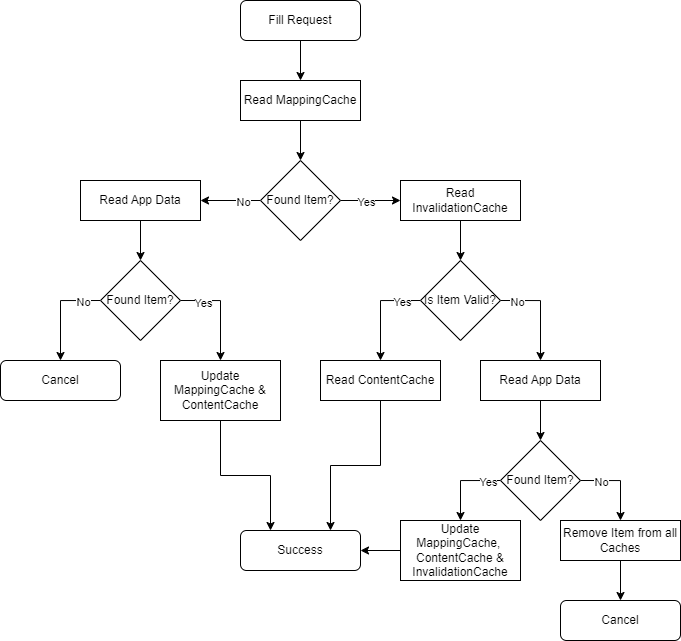

# Autofill Caching Strategy
This document describes the caching strategy used for the autofill service.

###### Table of Contents
1. [Workflow](#workflow)
2. [Caches](#caches)

<br/>

## Workflow
The Android OS sends a _FillRequest_ to the autofill service. This request is processed by the `PasswordVaultAutofillService`-class, which itself outsources the fill request entirely to `FillRequestHandler`. This class does the following to retrieve the desired autofill data:



<br/>

## Caches
The autofill service uses three different caches to fulfill it's task. All of these types are described in this section.

###### Mapping Cache
The `MappingCache` maps a _package name_ to a list of _UUIDs_. Each UUID represents an account that contains autofill data for the respective app. The cache is stored in the file _/autofill/mapping.cache_ within the internal app storage.

The mapping cache looks as follows:
```csv
<package_name1>;<uuid11>,<uuid12>,<uuid13>,...
<package_name2>;<uuid21>,<uuid22>,<uuid23>,...
<package_name3>;<uuid31>,<uuid32>,<uuid33>,...
...
```

An example might be:
```csv
de.christian2003.passwordvault;bd4fc592-f9c9-4d39-8705-164789a2df32
com.example.login;8fd1195f-b84e-4ccf-98fb-771e8ad757c0,932714cc-5bc0-4656-b709-5070ae596d8a,8220d6ba-e3cc-4dfb-87ca-efbb9f89385f
com.companyname.test;29911ca7-2c1e-49c2-a346-6089dc3692ed,19cb7668-f16a-4780-81f8-ea55b1bb8d7a
```

###### Content Cache
The `ContentCache` stores _username_, _password_ and _entry name_ for an account, which is represented through it's _UUID_ within the cache. The cache is stored in the file _/autofill/content.cache_ within the internal app storage.

The content cache looks as follows:
```csv
<uuid1>;<username1>,<password1>,<entry1>
<uuid2>;<username2>,<password2>,<entry2>
<uuid3>;<username3>,<password3>,<entry3>
...
```

An example might be:
```csv
bd4fc592-f9c9-4d39-8705-164789a2df32;test123@gmail.com,helloworld,PasswordVault Account
932714cc-5bc0-4656-b709-5070ae596d8a;UserId1,,Login Account
19cb7668-f16a-4780-81f8-ea55b1bb8d7a;,abc123,Test Account
```

Please note that username, password and entry name are encrypted through AES the same way that normal app storage is encrypted.

If no password or username is available with an account, the respective column is simply left empty. The name of the entry must always be set.

###### Invalidation Cache
The `InvalidationCache` stores the _UUID_ of each entry that has been changed by the user and is no longer valid.

The invalidation cache looks as follows:
```csv
<uuid1>;
<uuid2>;
<uuid3>;
...
```

An exmple might be:
```csv
bd4fc592-f9c9-4d39-8705-164789a2df32;
932714cc-5bc0-4656-b709-5070ae596d8a;
19cb7668-f16a-4780-81f8-ea55b1bb8d7a;
```

<br/>

***
2024-04-01  
&copy; Christian-2003
