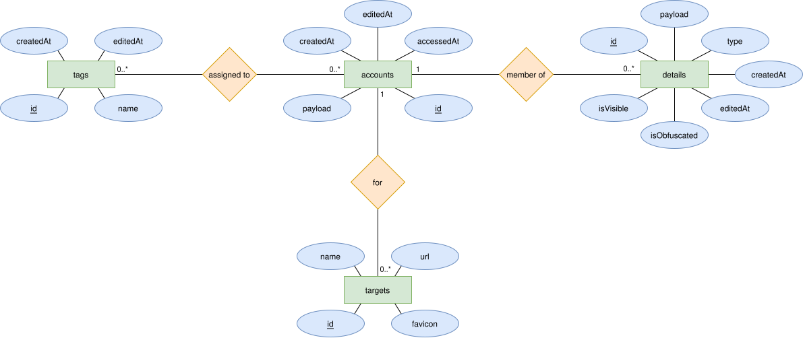
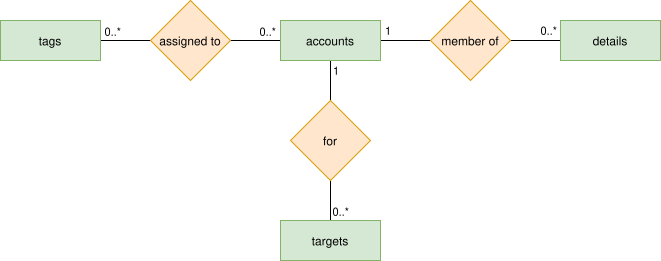

# Database
This document describes the database architecture for the app Password Vault.
The document applies with version 3.8.0. Older versions of the app do not utilize a database and rely on the internal file storage instead.

### Table of Contents
* [1 Database Description](#1-database-description)
    * [1.1 Schema](#11-schema)
    * [1.2 Tables](#12-tables)
        * [1.2.1 Accounts](#121-accounts)
        * [1.2.2 Details](#122-details)
        * [1.2.3 Targets](#123-targets)
        * [1.2.4 Tags](#124-tags)
        * [1.2.5 accounts_tags_cross_ref](#125-accounts_tags_cross_ref)
    * [1.3 Relations](#13-relations)
* [2 Migrations](#2-migrations)

 

## 1 Database Description
This chapter contains all details about the database description.

 

### 1.1 Schema
The database schema can be described through the following UML diagram:

The schema can be translated into the following database entities:
* `accounts (id, payload, createdAt, editedAt, accessedAt)`
* `details (id, account, payload, type, createdAt, editedAt, isObfuscated, isVisible)`
* `targets (id, account, name, url, favicon)`
* `tags (id, name, createdAt, editedAt)`
*  `accounts_tags_cross_ref (account, tag)`

 

### 1.2 Tables
This section briefly describes all tables and their attributes.

 

#### 1.2.1 Accounts
The Accounts table contains information on each account that is stored within the app.

The table contains the following attributes:
Attribute | Type | Description
--------- | ---- | -----------
id | Uuid (Blob) | Primary key
payload | ByteArray (Blob) | Sensitive information (name, description) that is being encrypted while stored within the database.
createdAt | LocalDateTime (Integer) | Timestamp at which the account was created.
editedAt | LocalDateTime (Integer) | Timestamp at which the account was edited the last time.
accessedAt | LocalDateTime (Integer) | Timestamp at which the account was accessed (e.g. viewed or used for autofill) the last time.

 

#### 1.2.2 Details
The Details table contains information on an account details. Details are specific information about accounts, like passwords, usernames, email addresses, birthdays, ...

The table contains the following attributes:
Attribute | Type | Description
--------- | ---- | -----------
id | Uuid (Blob) | Primary key
account | Uuid (Blob) | Foreign key referencing the account to which the detail belongs.
payload | ByteArray (Blob) | Sensitive information (name, content) that is being encrypted while stored within the database. Examples are usernames, passwords or email addresses.
type | DetailType (Text) | Autofill type of the detail.
createdAt | LocalDateTime (Integer) | Timestamp at which the detail was created.
editedAt | LocalDateTime (Integer) | Timestamp at which the detail was edited the last time.
isObfuscated | Boolean (Integer) | Flag indicates whether the detail content should be visually obfuscated when displayed. Usually used for highly sensitive data like passwords or credit card numbers.
isVisible | Boolean (Integer) | Flag indicates whether the detail is visible by default or hidden to the user.

 

#### 1.2.3 Targets
The targets table contains information on the autofill targets of an account. Each account can have multiple autofill targets which indicate Android apps or websites which should be auto-filled using the account details.

The table contains the following attributes:
Attribute | Type | Description
--------- | ---- | -----------
id | Uuid (Blob) | Primary key
account | Uuid (Blob) | Foreign key referencing the account to which the target belongs.
name | String (Text) | Package name of an Android app or host name of the website.
url | String (Text) | For Android apps, this is the URL containing the certificate fingerprint hash and package name. For websites, this is the website URL to autofill.
favicon | String (Text) | For websites, this is the name of the cached favicon file that is shown to the user when viewing the account.

 

#### 1.2.4 tags
The tags table contains information about tags. Tags can be used to group accounts. Examples for tags are "Work", "University", "Private", "School", "Finances", ...

The table contains the following attributes:
Attribute | Type | Description
--------- | ---- | -----------
id | Uuid (Blob) | Primary key
name | String (Text) | Display name of the tag.
createdAt | LocalDateTime (Integer) | Timestamp at which the tag was created.
editedAt | LocalDateTime (Integer) | Timestamp at which the tag was edited the last time.

 

#### 1.2.5 accounts_tags_cross_ref
The accounts_tags_cross_ref table contains information on which tags are assigned to which account. This is required since tags can be assigned to multiple accounts at the same time.

The table contains the following attributes:
Attribute | Type | Description
--------- | ---- | -----------
account | Uuid (Blob) | Primary and foreign key. References the account.
tag | Uuid (Blob) | Primary and foreign key. References the tag.

 

## 1.3 Relations
The following graphic shows the relations between the database:

 

## 2 Migrations
There are no migrations so far.

 

***
2026-02-12  
&copy; Christian-2003
