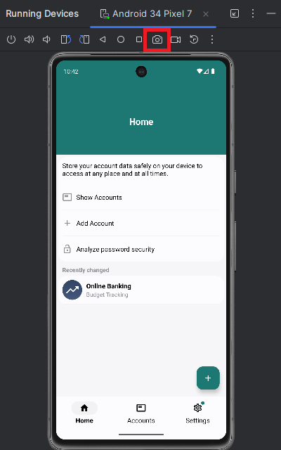
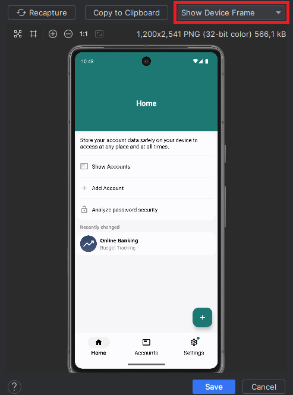
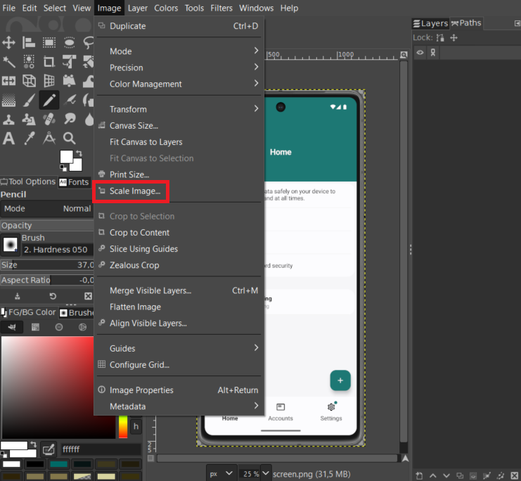
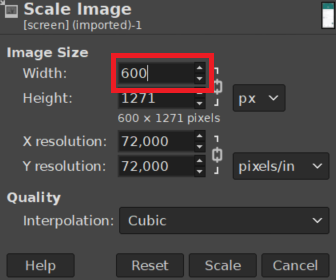
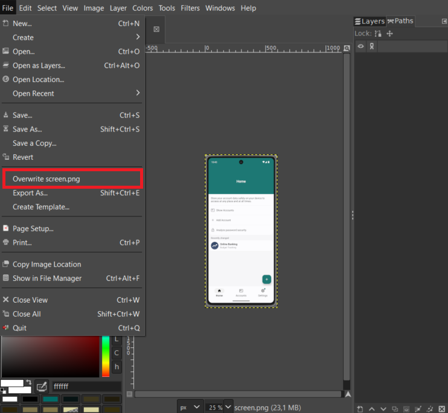
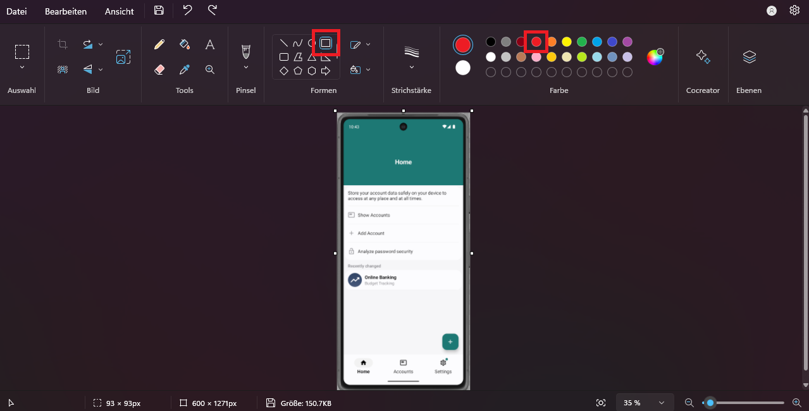

# Help Pages
This document describes the process of adding new help pages to the app.

###### Table of Contents
1. [General Guidelines](#general-guidelines)
2. [Structure for Help Pages](#structure-for-help-pages)
3. [Images](#images)

<br/>

## General Guidelines

###### When to Create Help Pages
Help pages should always be useful to the user. Do not create help pages that are unnecessary.

Since help pages contribute to a large portion of the APK file size (due to images), keep the number of help pages to a minimum.

However, whenever you create a help page, make sure to provide as many details as possible to make sure that every possible user can understand your help page.

<br/>

## Structure for Help Pages

###### Introduction
Help pages should always include a topmost headline which contains the name for the help page. Afterwards, the page should contain a brief (but interesting) description of the page. The user should be able to decide whether the page is of actual help for his problem by reading this description. Please only provide truthful information within this chapter and do not try to lur the user into reading the help page. An example could be as follows:

_backup.html_
```html
<h1>Backups</h1>
<p>Create a backup to transfer data between devices or to save your data somewhere else in case you
    loose your device.</p>
```

###### Table of Contents
After this introduction, provide a table of contents so that the user can easily jump between important parts of the page Use `<a>`-elements linking to the corresponding headline. For this to work, the headline must have an ID corresponding to the name of the linked fragment. An example could be as follows:

_backup.html_
```html
<h3>Table of Contents</h3>
<ol>
    <li><a href="#create-backup">Create Backup</a></li>
    <li><a href="#encrypt-backup">Encrypt Backup</a></li>
    <li><a href="#restore-backup">Restore Backup</a></li>
</ol>

<h2 id="create-backup">Create Backup</h2>
<!-- ... -->
```

###### Use of Headlines
Please only use `<h1>`, `<h2>` and `<h3>` headlines with help pages.

Please only use an `<h1>` headline as the very first headline within the document. Subsequent chapters should use `<h2>` headlines. If subchapters are required, use `<h3>` headlines. An example might be as follows:

_backup.html_
```html
<h1>Backups</h1>

<h3>Table of Contents</h3>
<!-- ... -->

<h2 id="create-backup">Create Backup</h2>
<h3>Select Folder</h3>
<h3>Configure Backup</h3>
<h3>Encrypt Backup</h3>

<h2 id="restore-backup">Restore Backup</h2>
<h3>Select File</h3>
<h3>Configure Restoration</h3>
<h3>Decrypt Backup</h3>

<!-- ... -->
```

###### HTML Structure
Please use the following structure for HTML files:

```html
<!DOCTYPE html>

<html lang="en">
<head>
    <title><!-- Enter name here --></title>
    <meta charset="UTF-8">
    <meta name="viewport" content="width=device-width,initial-scale=1.0">
    <link rel="stylesheet" href="../res/styles/default.css">
</head>

<body>
    <!-- ... -->
</body>
</html>
```

<br/>

## Images
Help pages should include images as visual guidance for the user.

###### Which Images to Include
If possible, only include images from within the app.

If other images need to be included within help pages, different rules apply. However, these rules might be different from case to case. In general, do not include stock photos and make sure to not violate any copyright laws.

###### General Guidelines
Save images for help pages to the folder [app/src/main/assets/help/res/img/](./../../app/src/main/assets/help/res/img/).

Make sure to provide a suitable name for the image. Please use PNG format to store the image, as parts of the image need to be transparent. To reduce file size, follow the steps described [here](#create-new-images).

###### Create New Images
Images from within the app shall only be created through the emulator. To retain consistancy, prefer using the Google Pixel 7 as emulated device. However, other devices can be used as well if required.

Create an image as follows:

<div align="center">
    
</div>

Next, save the image. However, make sure that the device frame is included beforehand:

<div align="center">
    
</div>

Since these images are included within the APK file, make sure that the image size is relatively small. We need to keep the image as PNG file so that the background can be transparent. Reduce the file size reducing the image dimensions. To do so, open the image in an image editor like GIMP.

If you use GIMP, click on **Image > Scale Image...**:

<div align="center">
    
</div>

A new popup-window appears. We recommend to reduce the image dimensions by 50%. In this example, the image width is _1.200 px_. Reduce this number to _600 px_ and click **Scale** afterwards:

<div align="center">
    
</div>

This should reduce the image file size by approximately _75 %_. Afterwards, the image usually has a file size of around _170 kB_. Images of this size can be packaged within the APK file without causing much trouble.

Next, save the image by clicking **File > Ovewrite &lt;xyz&gt;.png**:

<div align="center">
    
</div>

###### Highlight Content on Images
Sometimes, it might be useful to highlight some particular parts of an image to gain the user's attention. Please reduce the highlighted parts of any image as much as possible.

To highlight parts, we recommend to follow these steps:

Firstly, open the image (whose size was already reduced as explained [here](#create-new-images)) with Paint. Select the square Shape and red color and highlight whatever you want:

<div align="center">
    
</div>

Afterwards, save the changes.

###### Reference Images
When referencing images from within help pages, always use relative URIs to make sure that reference would technically work for different locales. An example could be as follows:

_backup.html_
```html

```

<br/>

***
2024-06-04  
&copy; Christian-2003
