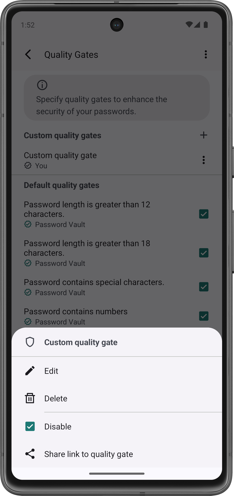

# MoreDialog
```java
public class MoreDialog extends PasswordVaultBottomSheetDialog<MoreViewModel> implements MoreRecyclerViewAdapter.DialogContract
```
Class implements a dialog displaying multiple options (e.g. buttons or checkboxes) as context actions.

###### Table of Contents
1. [Overview](#overview)
2. [Public Fields](#public-fields)
3. [Public Constructors](#public-constructors)
4. [Public Methods](#public-methods)

<br/>

## Overview
This class can be used to show multiple context actions within a dialog.
```java
public class MyActivity extends PasswordVaultActivity<MyViewModel> implements MoreDialogCallback {

    public MyActivity() {
        super(MyViewModel.class, R.layout.activity_my);
    }


    @Override
    public void onCreate(Bundle savedInstanceState) {
        super.onCreate(savedInstanceState);

        //Show MoreDialog once the button is clicked:
        findViewById(R.id.button).setOnClickListener(this::showMoreDialog);
    }


    //Handle callbacks from the dialog:
    public void onDialogItemClicked(MoreDialog dialog, String tag, int position) {
        switch(tag) {
            case "tag_edit":
                //Handle context action...
                break;
            case "tag_delete":
                //Handle context action...
                break;
            case "tag_disable":
                //Handle context action...
                break;
            case "tag_share":
                //Handle context action...
                break;
        }
    }


    //Show the dialog
    private void showMoreDialog() {
        MoreDialog dialog = new MoreDialog();
        Bundle args = new Bundle();

        //Configure context actions:
        ArrayList<Item> items = new ArrayList<>();
        items.add(new ItemButton("Edit", "tag_edit", R.drawable.ic_edit));
        items.add(new ItemButton("Delete", "tag_delete", R.drawable.ic_delete));
        items.add(new ItemDivider());
        items.add(new ItemCheckbox("Disable", "tag_disable", true));
        items.add(new ItemButton("Share link to quality gate", "tag_share", R.drawable.ic_share));

        //Configure dialog:
        args.putSerializable(MoreDialog.ARG_ITEMS, items);
        args.putString(MoreDialog.ARG_TITLE, "Custom quality gate");
        args.putInt(MoreDialog.ARG_ICON, R.drawable.ic_shield);

        dialog.setArguments(args);
        dialog.show(getSupportFragmentManager(), null);
    }

}
```

Please note that the host for the dialog must always implement the [`MoreDialogCallback`](MoreDialogCallback.md)-interface to handle callbacks.

Using a combination of [`ItemButton`](ItemButton.md)-, [`ItemDivder`](ItemDivider.md)- and [`ItemCheckbox`](ItemCheckbox.md)-instances, an example for a MoreDialog might look as follows:
<div align="center">
    
</div>

<br/>

## Summary

###### Public Fields
Field | Description
--- | ---
[`ARG_TITLE`](#arg_title) | Key to use when passing the title of the dialog as argument.
[`ARG_ICON`](#arg_icon) | Key to use when passing the drawable resource for the icon of the dialog as argument.
[`ARG_ITEMS`](#arg_items) | Key to use when passing the list of items of the dialog as argument.

###### Public Constructors
Constructor | Description
--- | ---
[`MoreDialog()`](#moredialog) | Constructor to create a new dialog.

###### Public Methods
Method | Description
--- | ---
[`onCreateView(LayoutInflater, ViewGroup, Bundle)`](#oncreateview) | Method is called whenever the view for the dialog is created.
[`onAttach(Context)`](#onattach) | Method is called whenever the dialog is attached to a fragment or activity.
[`onActionInvoked(String, int)`](#onactioninvoked) | Method is called whenever a context action is invoked.

<br/>

***

## ARG_TITLE
```java
public static final String ARG_TITLE = "arg_title";
```
Key to use when passing the title for the dialog as argument. The title must be passed as string argument.

## ARG_ICON
```java
public static final String ARG_ICON = "arg_icon";
```
Key to use when passing the ID of the drawable resource to use as icon for the dialog as argument. The ID of the drawable resource must be passed as integer argument.

## ARG_ITEMS
```java
public static final String ARG_ITEMS = "arg_items";
```
Key to use when passing the list of context action items as argument. The list must be passed as serializable argument. Furthermore, the list passed must be of type `ArrayList<Item>`.

<br/>

***

## MoreDialog
```java
public MoreDialog()
```
Constructor instantiates a new MoreDialog.

<br/>

***

## onCreateView
```java
@Nullable
@Override
public View onCreateView(
    @NonNull LayoutInflater inflater,
    @Nullable ViewGroup container,
    @Nullable Bundle savedInstanceState
)
```
Method is called whenever the view for the dialog is created. This method must not be called by anyone but the Android framework.

###### Parameters
Parameter | Description
--- | ---
`inflater` | Layout inflater used to inflate the dialog view.
`container` | Parent container view for the dialog.
`savedInstanceState` | Previously saved state of the instance.

###### Returns
Inflated view for the dialog.

## onAttach
```java
@Override
public void onAttach(@NonNull Context context)
```
Method is called whenever the dialog is attached to a host context. This method must not be called by anyone but the Android framework.

###### Parameters
Parameter | Description
--- | ---
`context` | Context to which the dialog is attached.

## onActionInvoked
```java
@Override
public void onActionInvoked(
    String tag,
    int position
)
```
Method is called whenever a context action is invoked which dismisses the dialog and informs the host callback about the context action invoked.

###### Parameters
Parameter | Description
--- | ---
`tag` | Tag of the context action invoked.
`position` | Position of the context action within the dialog.

<br/>

***

2025-01-12  
&copy; Christian-2003
