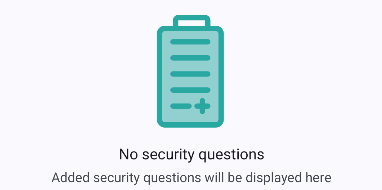

# RecyclerViewAdapter.GenericEmptyPlaceholderViewHolder
```java
public static class RecyclerViewAdapter.GenericEmptyPlaceholderViewHolder extends RecyclerView.ViewHolder
```
View holder for the generic empty placeholder. This placeholder can be displayed whenever a list of data is empty. Therefore, the view represents the empty state of that list.

###### Table of Contents
1. [Overview](#overview)
2. [Public Fields](#public-fields)
3. [Public Constructors](#public-constructors)

<br/>

## Overview
Create a new view holder of this type as follows:
```java
@Override
@NonNull
public RecyclerView.ViewHolder onCreateViewHolder(@NonNull ViewGroup parent, int viewType) {
    switch (viewType) {
        case TYPE_GENERIC_EMPTY_PLACEHOLDER:
            View itemView = layoutInflater.inflate(R.layout.item_generic_empty_placeholder, parent, false)
            return new GenericEmptyPlaceholderViewHolder(itemView);
        // ...
    }
}
```

An example for an inflated and updated headline button might be as follows:
<div align="center">
    
</div>

<br/>

## Summary
###### Public Fields
Field | Description
--- | ---
[`imageView`](#imageView) | Image view displaying the placeholder image.
[`headlineTextView`](#headlinetextview) | Text view displaying the headline text.
[`supportTextView`](#supporttextview) | Text view displaying the support text.

###### Public Constructors
Constructor | Description
--- | ---
[`GenericEmptyPlaceholderViewHolder(View)`](#genericheadlineviewholder) | Constructor to create a new view holder from the passed view.

<br/>

***

## imageView
```java
public final ImageView imageView;
```
Image view displaying the placeholder image at the center of the view. The drawable of the view is `null` by default. Therefore, setting the drawable through `buttonImageView.setDrawable()` is required when updating the view holder.  
The style for this image view does not contain any value for `app:tint`. Therefore, drawables with multiple colors can be used.

<br/>

## headlineTextView
```java
public final TextView headlineTextView;
```
Text view displaying the headline text of the empty placeholder. It is recommended to use a short text like "No security questions" to inform the user about the absense of data.

<br/>

## supportTextView
```java
public final TextView supportTextView;
```
Text view displaying the supporting text of the empty placeholder. It is recommended to use a short text like "Added security questions will be displayed here" to inform the user about what would happen, if data is available.

<br/>

***

## GenericHeadlineViewHolder
```
public GenericHeadlineViewHolder(View itemView)
```
Constructor instantiates a new view holder from the inflated view that is passed as parameter.

###### Parameters
Parameter | Description
--- | ---
`itemView` | Inflated view from which to create the view holder.

<br/>

***
2024-08-25  
&copy; Christian-2003
