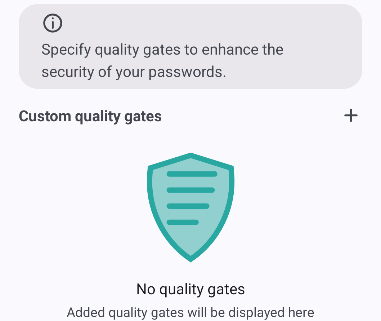

# RecyclerViewAdapter
```java
public abstract class RecyclerViewAdapter<V extends ViewModel> extends RecyclerView.Adapter<RecyclerView.ViewHolder>
```
Base class for recycler view adapters within Password Vault.

###### Generic Types
Generic Type | Description
--- | ---
`V extends ViewModel` | Type of the view model from which the recycler view sources its data. This is usually the same view model used by the host activity.

###### Table of Contents
1. [Overview](#overview)
2. [Nested Types](#nested-types)
3. [Public Fields](#public-fields)
4. [Protected Fields](#protected-fields)
5. [Public Constructors](#public-constructors)

<br/>

## Overview
This recycler view adapter provides basic functionality that needs to be handled by all recycler view adapters within the app. Extend this recycler view adapter and override the required methods:
```java
public class MyRecyclerViewAdapter extends RecyclerViewAdapter<MyViewModel> {

    public MyRecyclerViewAdapter(@NonNull Context context, @NonNull MyViewModel viewModel) {
        super(context, viewModel);
    }


    @NonNull
    @Override
    public RecyclerView.ViewHolder onCreateViewHolder(@NonNull VIewGroup parent, int viewType) {
        // Create view holders here.
    }


    @Override
    public void onBindViewHolder(@NonNull RecyclerView.ViewHolder holder, int position) {
        // Update view holders here.
    }


    @Override
    public int getItemViewType(int position) {
        // Return item view types here. This method is optional and is not required.
    }


    @Override
    public getItemCount() {
        // Return item count here.
    }

}
```

Use the adapter in your activities like this:
```java
public class MyActivity extends PasswordVaultActivity<MyViewModel> {

    public MyActivity() {
        super(MyViewModel.class, R.layout.activity_my);
    }


    @Override
    public void onCreate(Bundle savedInstanceState) {
        super.onCreate(savedInstanceState);

        RecyclerView recyclerView = findViewById(R.id.recycler_view);
        MyRecyclerViewAdapter adapter = new MyRecyclerViewAdapter(this, viewModel);
        recyclerView.setAdapter(adapter);
    }

}
```

Using the generic view holders, an example for a recycler view created this way could look as follows:
<div align="center">
    
</div>

<br/>

## Summary

###### Nested Types
Nested Type | Description
--- | ---
[`GenericInfoViewHolder`](RecyclerViewAdapter.GenericInfoViewHolder.md) | View holder for info items within pages.
[`GenericHeadlineViewHolder`](RecyclerViewAdapter.GenericHeadlineViewHolder.md) | View holder for headlines within pages.
[`GenericHeadlineButtonViewHolder`](RecyclerViewAdapter.GenericHeadlineButtonViewHolder.md) | View holder for headlines within pages. These headlines can be clicked and display an image icon.
[`GenericEmptyPlaceholderViewHolder`](RecyclerViewAdapter.GenericEmptyPlaceholderViewHolder.md) | View holder for empty placeholders to use when a list of data is empty.

###### Public Fields
Field | Description
--- | ---
[`TYPE_GENERIC_INFO`](#type_generic_info) | View type for items with the `GenericInfoViewHolder`.
[`TYPE_GENERIC_HEADLINE`](#type_generic_headline) | View type for items with the `GenericHeadlineViewHolder`.
[`TYPE_GENERIC_HEADLINE_BUTTON`](#type_generic_headline_button) | View type for items with the `GenericHeadlineButtonViewHolder`.
[`TYPE_GENERIC_EMPTY_PLACEHOLDER`](#type_generic_empty_placeholder) | View type for items with the `GenericEmptyPlaceholderViewHolder`.

###### Protected Fields
Field | Description
--- | ---
[`TAG`](#tag) | Tag that can be used for logging.
[`context`](#context) | Context for the adapter.
[`viewModel`](#viewmodel) | View model for the adapter.
[`layoutInflater`](#layoutinflater) | Layout inflater that can be used to inflate views for the adapter.
[`recyclerView`](#recyclerview) | Recycler view to which this adapter is attached.

###### Public Constructors
Constructor | Description
--- | ---
[`RecyclerViewAdapter(Context, V)`](#recyclerviewadapter) | Constructor to create a new recycler view adapter.

###### Public Methods
Method | Description
--- | ---
[`onAttachedToRecyclerView(RecyclerView)`](#onattachedtorecyclerview) | Method called whenever the adapter is attached to a recycler view.
[`getContext()`](#getcontext) | Returns the context of the recycler view.

<br/>

***

## TYPE_GENERIC_INFO
```java
public static final int TYPE_GENERIC_INFO = 2;
```
View type for the view holder displaying the generic info within a page.

<br/>

## TYPE_GENERIC_HEADLINE
```java
public static final int TYPE_GENERIC_HEADLINE = 4;
```
View type for the view holder displaying the generic headline within a page.

<br/>

## TYPE_GENERIC_HEADLINE_BUTTON
```java
public static final int TYPE_GENERIC_HEADLINE_BUTTON = 8;
```
View type for the view holder displaying the generic headline button within a page.

<br/>

## TYPE_GENERIC_EMPTY_PLACEHOLDER
```java
public static final int TYPE_GENERIC_EMPTY_PLACEHOLDER = 16;
```
View type for the view holder displaying the empty placeholder to use when a list of data is empty.

<br/>

***

## TAG
```java
protected static final String TAG = "RecyclerViewAdapter";
```
Tag that can be used with the logging framework from Android.

<br/>

## context
```java
@NonNull
protected final Context context;
```
Context for the adapter. This context is injected through the constructor. Therefore, this context can sometimes be not identical to the context of the [`recyclerView`](#recyclerview).

<br/>

## viewModel
```java
@NonNull
protected final V viewModel;
```
View model for the adapter. This is the view model passed to the constructor. Usually, this is the same view model used by the host activity.

<br/>

## layoutInflater
```java
@NonNull
protected final LayoutInflater layoutInflater;
```
Lyaout inflater to use when inflating child views for the adapter.

<br/>

## recyclerView
```java
protected final RecyclerView recyclerView;
```
Recycler view to which the adapter is attached. This value is set once the [`onAttachedToRecyclerView(RecyclerView)`]-method is called.

<br/>

***

## RecyclerViewAdapter
```java
public RecyclerViewAdapter(@NonNull Context context, @NonNull V viewModel)
```
Constructor instantiates a new recycler view adapter.

###### Parameters
Parameter | Description
--- | ---
`context` | Context for the recycler view adapter.
`viewModel` | View model from which the adapter should source its data. This is usually the same view model used by the host activity.

<br/>

***

## onAttachedToRecyclerView
```java
@Override
public void onAttachedToRecyclerView(@NonNull RecyclerView recyclerView)
```
Method is called whenever the adapter is attached to a recycler view.

###### Parameters
Parameter | Description
--- | ---
`recyclerView` | Recycler view to which the adapter is attached.

<br/>

## getContext
```
@NonNull
public Context getContext()
```
Returns the [context](#context) of the recycler view adapter. This contextis not always identical to the context of the [`recyclerView`](#recyclerview).

<br/>
