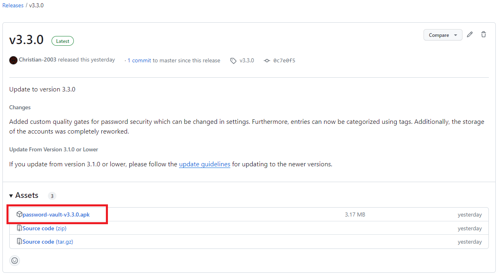

# Install and Run the App
This page describes how you can install and run Password Vault on your Android device.

###### Table of Contents
1. [System Requirements](#system-requirements)
2. [Install the Release APK](#install-the-release-apk)
3. [Cloning This Repository](#cloning-this-repository)

 

## System Requirements
The minimum required Android version to run Password Vault is **Android 12L** (SDK 32), since Password Vault requires numerous security features from the device's operating system to secure your data to the highest industrial standards.

> [!IMPORTANT]  
> Make sure that your Android device is updated to version Android 12.

Android Version 12 consists of two feature releases, 12 and 12L respectively. Password Vault requires the feature release 12L from March 2022. Read more about Android releases [here](https://developer.android.com/tools/releases/platforms).

If you do not know which Android version is installed on your device, go to **Settings > About phone > Software information > Android version**. If this does not work on your device, please consolidate your device's manual in order to find your current Android version.

 

## Install the Release APK
The recommended way to install Password Vault is to simply download the release APK file from GitHub. To do so, follow these steps:

###### Download the Release APK
You can download the newest release from the GitHub [releases](https://github.com/Christian-2003/password-vault/releases/latest)-page. We recommend to always download the newest release, as this contains all features and security updates. However, you can also download a previous release from [here](https://github.com/Christian-2003/password-vault/releases).

Once you have opened the GitHub releases-page, you may download the APK file.

    

###### Install the Release APK
After downloading a Password Vault release APK, you can locate the APK file through the file explorer on your Android device.

Once located, execute the downloaded APK file. If this is your first time installing Password Vault, your operating system warns you about the APK file, since the certificate for signing the APK file is not verified by Google or your device's manufacturer. You need to click **Install anyways** in order to install the APK file.

If you have already installed Password Vault, you can follow the same steps. Instead of installing Password Vault, your current installation will be updated, while keeping your data. The only exceptions to this is for updating to versions 3.2.0 or 3.6.0. To keep your data when updating from these versions, follow [this](Update%20to%20Newer%Versions.md) guide.

###### Run the App
In order to verify that the installation worked, you should open Password Vault. If the app can be opened, the installation worked as intended and you should not encounter any problems.

If you encounter any problems after installing the app, try reinstalling. If this still does not work, you can open an [issue](https://github.com/Christian-2003/password-vault/issues) so that we can take a look at the problem.

 

## Cloning This Repository
An alternative to downloading a release APK is to clone this repository instead. This gives you access to all features that are currently in development.

> [!CAUTION]
> We do not recommend to install the app using this method, since this will include features that might not work correctly and harm your app data.

To do so, follow these steps:

###### Clone the Repository
Firstly, you need to clone this repository, you can do this through GitHub Desktop or through the Git command line interface (CLI), by entering this command:  
`git clone https://github.com/Christian-2003/password-vault`

###### Open and Run the Project
After cloning the repository, you can open the project in Android Studio and run Password Vault either on an emulator or an Android device which is ready for debugging.

Alternatively, you can build your own release with the newly developed features.

###### General Info for Running the Project
Please note that many features within the repository are being developed. Such features may not work (correctly) to some extent and can even break your entire installation. Therefore, be cautious when doing this, we do not take any responsibility for any damage that might occur!

Furthermore, features may be changed or removed which could result in a complete loss of your data.

 

***
2024-11-08 
&copy; Christian-2003
