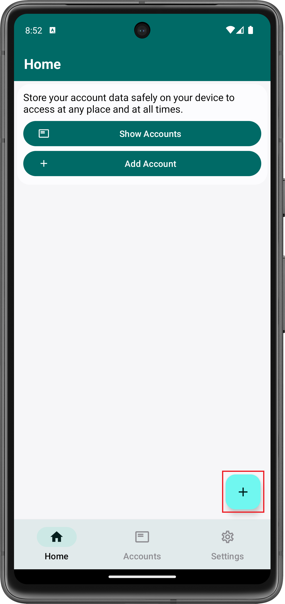
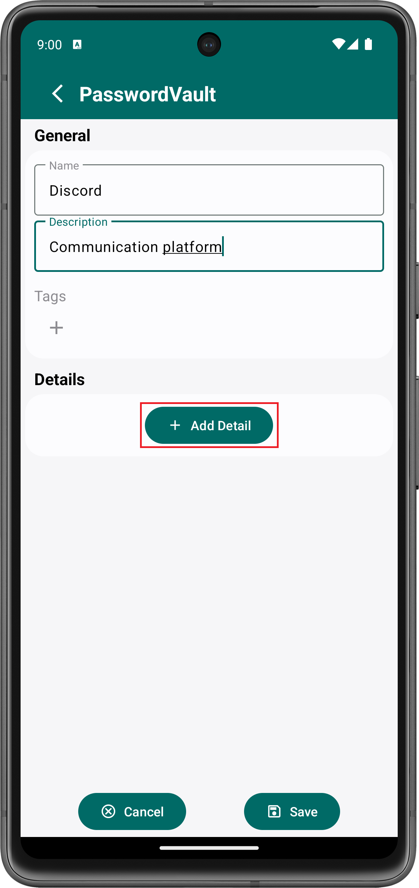
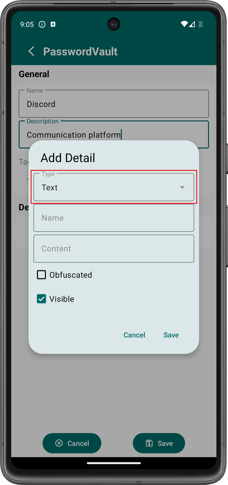
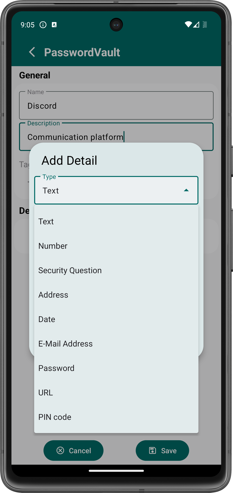
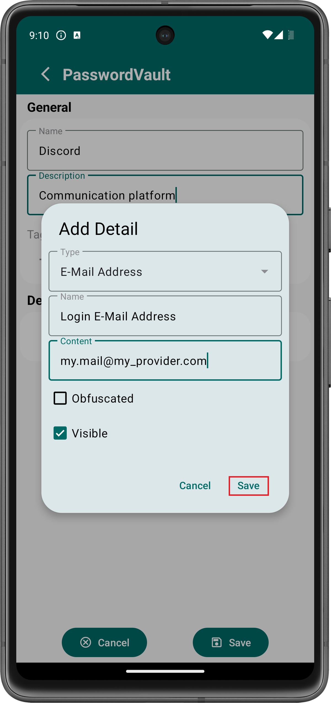
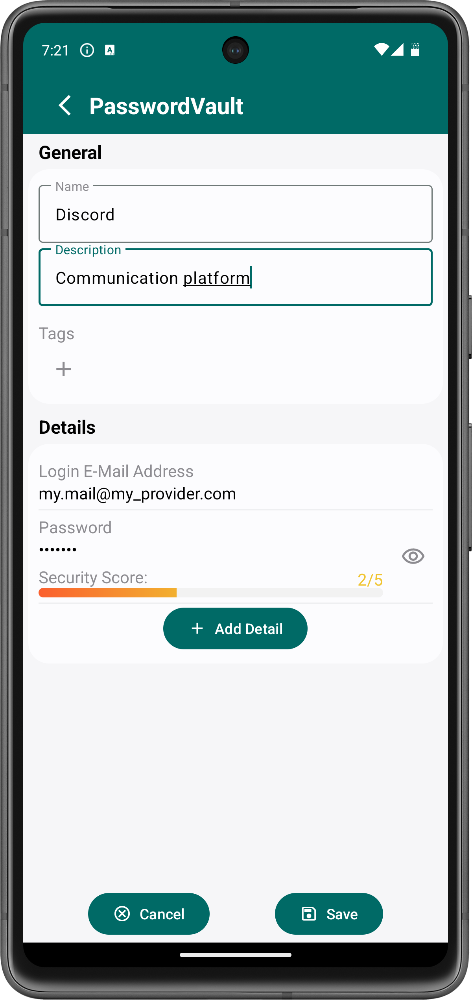
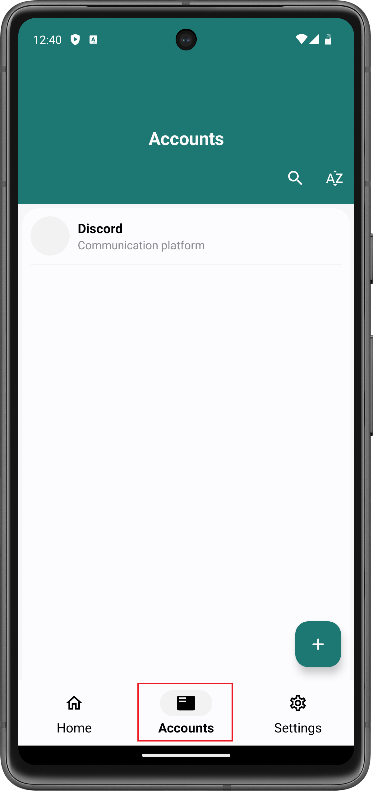
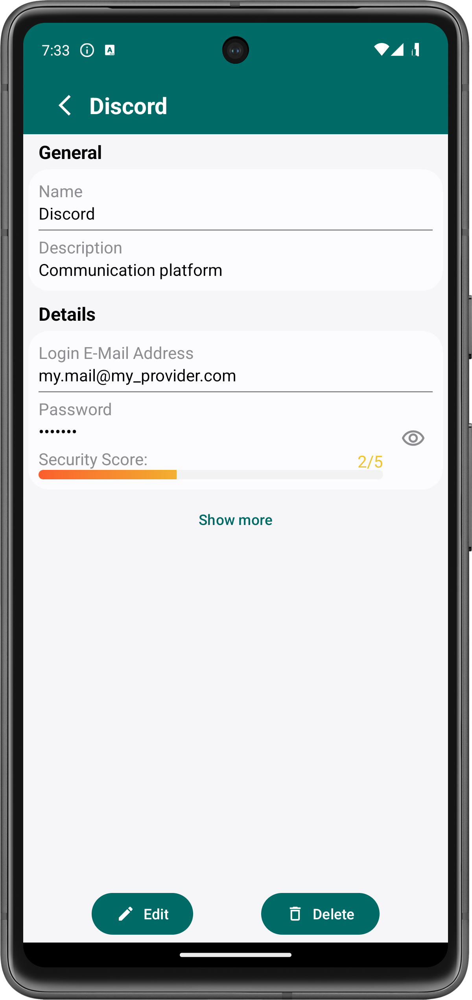

# Quickstart Guide
> [!NOTE]  
> This quickstart guide covers the older Password Vault version 3.3.0.

This document contains a guide on how to use Password Vault.

If you have not already installed Password Vault, there is a [guide](Install%20and%20Run%20the%20App.md) that explains the installation process.

###### Table of Contents
1. [What is Password Vault](#what-is-password-vault)
2. [Add New Accounts](#add-new-accounts)
3. [View Your Accounts](#view-your-accounts)

 

## What is Password Vault
Password Vault is an Android application through which you can store account information, such as passwords, e-mail addresses, pins, addresses and much more. The app allows you to centrally store all personal data that you provided to any number of accounts on your Android device locally.

In order to protect your data, the app employs the highest industrial encryption standards, which ensures data security and integrity. Furthermore, all data is stored locally on your phone. This prevents any sort of device synchronization but ensures that your data cannot be intercepted by anyone.

 

## Add New Accounts
Once you open Password Vault, you are presented the home screen. In order to add a new account, you need to click the **+**-button at the bottom right corner of the screen. This will open a new screen through which you can configure the account.

    

###### Provide Account Information
The name of the account, e.g. "Discord" and provide an optional description. You always need to enter a name, whereas a description is not necessarily required.

You have successfully enterd the most basic information about your account. However, you might want to add more sophisticated information, such as login data. To do so, press the **Add Detail**-button.

    

A new dialog should appear through which you can configure the added detail.

###### Configure a Detail
Once the dialog to configure a detail is opened, you need to specify the type of the detail. Some of the most populat types are:
* _Password_ lets you enter an account password,
* _E-Mail Address_ lets you enter an account e-mail addreses,
* _Security Question_ lets you enter a security question or
* _Text_ lets you enter plain text.

You can specify this type through the topmost dropdown dialog:

    
    

For example, let's select the **E-Mail Address**-type to enter an email-address.

Next, you can enter a name for the detail, let's enter "Login E-Mail-Address" since this detail is supposed to contain the e-mail address through which we have to login to Discord.

Next, you need to enter a content. In this case, this is the e-mail address with which we need to login.

Afterwards, click the **Save**-button to save the detail.

    

The detail should now appear above the **Add Detail**-button. Most details display only their name and content. However, some details (like passwords) display some additional information. In the case of passwords, a security score is displayed to indicate the password's security.

    

You can add as many details to an account as you like. Examples for details that you could add might be:
* Login e-mail addresses
* Passwords
* Security questions
* Recovery codes
* Birthdays
* Usernames
* Real names
* Real addresses
* ...

###### Save the Created Account
If you are happy with the configuration of the account, click the **Save**-button at the bottom right corner of the screen.

The next step shows you how to view the accounts that are configured within Password Vault.

 

## View Your Accounts
If you want to view an account that you have previously configured, go to the **Accounts** page.

    

This page displays a list of all your configured accounts. Let's click on **Discord** to view the previously configured account. This will show you all provided information about the account.

    

If you want to edit the account, click the **Edit**-button in the bottom left corner of the screen. This opens a new page through which you can edit the account the same way you [created](#add-new-accounts) it.

In order to delete the account, click the **Delete**-button in the bottom right corner of the screen.

 

***
2024-02-24  
&copy; Christian-2003
