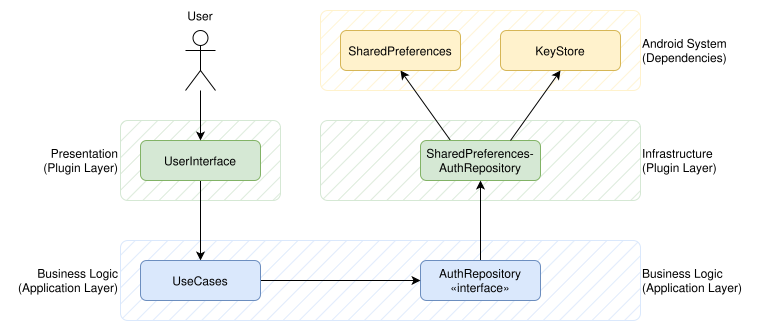
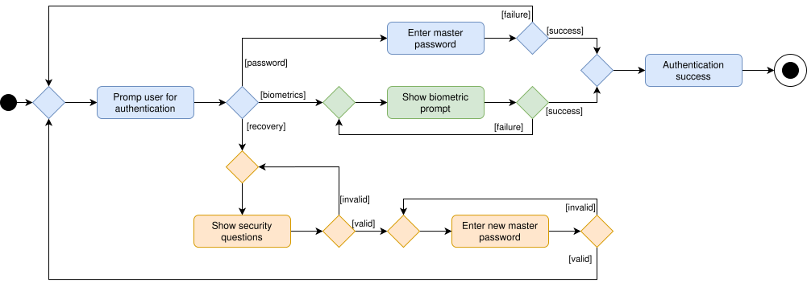
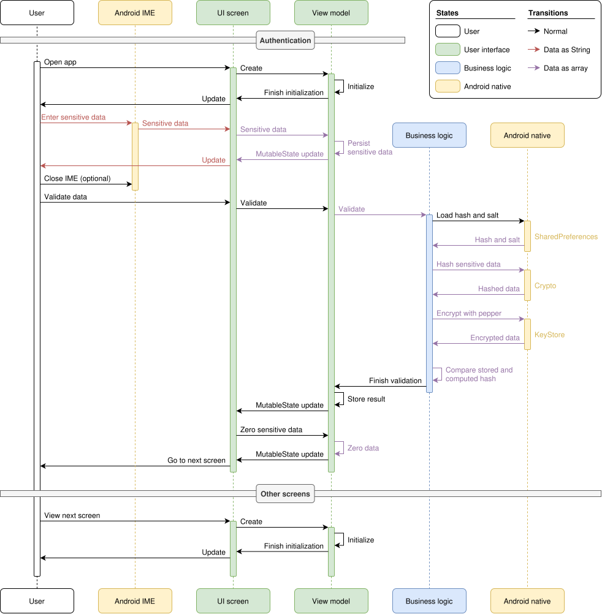
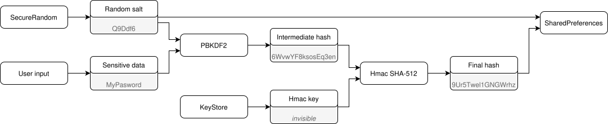

# Authenticaction Risk Analysis
This document analyzes possible risks and attack vectors to the authentication mechanisms of the Password Vault application for Android.

### Table of Contents
1. [Scope](#1-scope)
    * [What is In-Scope](#11-what-is-in-scope)
    * [What is Out-Scope](#12-what-is-out-scope)
    * [Infrastructure Assumptions](#13-infrastructure-assumptions)
    * [Threat Model Assumptions](#14-threat-model-assumptions)
2. [System Overview](#2-system-overview)
    * [Architecture](#21-architecture)
    * [UI Flow](#22-ui-flow)
    * [Data Storage](#23-data-storage)
    * [Cryptographic Algorithms](#24-cryptographic-algorithms)
3. [Attack Vectors and Risk Analysis](#3-attack-vectors-and-risk-analysis)
    * [Overview](#31-overview)
    * [Offline Brute-Force / Dictionary Attack (A01)](#32-offline-brute-force--dictionary-attack-a01)
    * [Physical Device Compromise (A02)](#33-physical-device-compromise-a02)
    * [Backups and Synchronization Leaks (A03)](#34-backups-and-synchronization-leaks-a03)
    * [Malicious App or Malware with Priviliges (A04)](#35-malicious-app-or-malware-with-priviliges-a04)
    * [In-memory Exposure and Logging (A05)](#36-in-memory-exposure-and-logging-a05)
    * [Side-Channel / Timing / Comparator Attacks (A16)](#37-side-channel--timing--comparator-attacks-a06)
    * [Threats to Security Questions (A07)](#38-threats-to-security-questions-a07)
    * [UI and OS Features (A08)](#39-ui-and-os-features-a08)
4. [Mitigations](#4-mitigations)

 

## 1 Scope
This analysis applies to the Password Vault application for Android, and considers the authentication mechanisms that are implemented beginning with version 3.8.0 and later.

### 1.1 What is In-Scope
The following aspects are considered "in scope" and are regarded by this analysis:
* Local-only auhentication
* `SharedPreferences` storage
* `KeyStore` storage
* Optional biometric authentication
* Optional security questions

### 1.2 What is Out-Scope
The following aspects are considered "out of scope" and are therefore not regarded any further:
* Server-side attacks
* Network transit risks
* User-related issues such as social engineering
* Rooted Android devices

### 1.3 Infrastructure Assumptions
The following assumptions are made, in order for this analysis to apply:
* Password Vault version 3.8.0 or higher is used
* Android OS version 14 (API 34) or higher is installed
* No remote backend server is present

### 1.4 Threat Model Assumptions
The following assumptions apply to possible threats that the app needs to face:
* Attackers have full access to the device storage
* Attackers have access to an unlocked Android device without OS-level data protection
* Attackers have installed malware on the Android device

 

## 2 System Overview
This section provides a brief overview of the system that is implemented to handle user authentication.

### 2.1 Architecture
The following diagram briefly illustrates the overall architecture for the authentication system:
 

The diagram shows the interaction between the user and the interface.  
The interface itself works with application layer use cases that encapsulate all business logic, such as password validation and security question verification.  
The use cases access the specific data on the disk through a repository, which itself accesses external Android dependencies, such as `SharedPreferences` or `KeyStore`.

### 2.2 UI Flow
The UI flow is illustrated through the following diagram:
 

The flow shows that the app prompts the user for authentication before they can access app data. They can choose between three options:
* **Password Authentication:** The user authenticates through their master password.
* **Biometric Authentication:** If configured, the user authenticates through biometrics, such as fingerprints or facial recognition.
* **Recovery:** If configured, the user can recover their master password through security questions.

### 2.3 Data Storage
Throughout the app lifecycle, data related to authentication is stored in multiple spaces. These include the following:
* Android `SharedPreferences`
* Android `KeyStore`
* Temporary storage areas such as RAM, CPU caches or registers

Data is not permitted to be stored in permanent storage areas such as an SSD.

Data flows as follows:
* **Password Setup:** Entry -> Hashing -> Storage in `SharedPreferences`
* **Recovery Setup:** Entry -> Hashing -> Storage in `SharedPreferences`
* **Password Authentication:** Entry -> Hashing -> Compare with password hash in `SharedPreferences`
* **Recovery Authentication:** Entry -> Hashing -> Compare with password hash in `SharedPreferences`

Generally speaking, data flows either as String or array (e.g. `ByteArray` or `CharArray`). The following diagram demonstrates where data flows:

The diagram shows, that the user can enter sensitive data (e.g. passwords or security answers) into the user interface through the Android IME. The data is stored in the view model until validation is started.  
Once validation starts, business logic is invoked that orchestrates calls to Android libraries. These calls are required for secure handling of data, like loading hash and salt from `SharedPreferences` as well as cryptographic operations.  
Within the app, sensitive data flows as `ByteArray` or `CharArray`. After use, these arrays are filled with '0' or '\u0000' to hide the sensitive data until garbage collection. This minimizes the chances of data being visible on the heap or in memory dumps. Excluded from this are system operations, like the communication between the app and the IME keyboard. Jetpack Compose always handles text-data as `String`. Therefore, until the data is retrieved from the UI composables, it is stored in string-format. However, using arrays outside composable-scope greatly reduces the number of `String`-instances and thus chances of leaking sensitive data in heap or dumps.

### 2.4 Cryptographic Algorithms
The app uses the following cryptographic algorithms for authentication purposes:
* Password-Based Key Derivation Function 2 (PBKDF2)
* Secure Hash Algorithm 2 (SHA-512)
* Hash-Based Message Authentication Code (Hmac)

The following diagram illustrates how these algorithms are used for authentication:

The diagram shows that the user input is hashed using PBKDF2 alongside a randomly generated salt. The resulting intermediate hash is then hashed using Hmac SHA-512 with a secret key from the `KeyStore`. The resulting final hash is then stored in the SharedPreferences as password or security question answer.

 

## 3 Attack Vectors and Risk Analysis
This section describes a list of possible attacks to the authentication implementation for the app.

### 3.1 Overview
This table summarizes attack vectors and their mitigations. 

ID |Attack Vector | Preconditions | Likelihood | Impact | Mitigations
--- | --- | --- | --- | --- | ---
A01 | [Offline brute-force / dictionary attack](#32-offline-brute-force--dictionary-attack-a01) | Access to the device storage | :red_circle: High | :red_circle: High | M01, M02
A02 | [Physical device compromise](#33-physical-device-compromise-a02) | Access to the (unlocked) physical device | :green_circle: Low | :green_circle: Low Unless device is acquired by professionals (e.g. law enforcement) | M02
A03 | [Backups and synchronization leaks](#34-backups-and-synchronization-leaks-a03) | App files are backed-up | :green_circle: Low | :red_circle: High | M02, M03, M04, M05
A04 | [Malicious app or malware with priviliges](#35-malicious-app-or-malware-with-priviliges-a04) | Malware, third-party IME or Accessibility Services capture inputs (like passwords) before they are processed | :yellow_circle: Medium | :red_circle: High | M06, M07, M08, M09, M10
A05 | [In-memory exposure and logging](#35-in-memory-exposure-and-logging-a05) | Sensitve data is stored in temporary memory or is included in logs | :red_circle: High | :yellow_circle: Medium | M11, M12, M13, M14, M15
A06 | [Side-channel / timing / comparator Attacks](#37-side-channel--timing--comparator-attacks-a06) | Attacker can observe timing differences when verifying passwords | :yellow_circle: Medium | :green_circle: Low | M17, M17, M18
A07 | [Threats to security questions](#38-threats-to-security-questions-a07) | Users uses low-entropy answers | :red_circle: High | :red_circle: High | M02, M19, M20
A08 | [UI and OS features](#39-ui-and-os-features-a08) | UI or OS leaks sensitive app content, such as through autofill or screenshots | :red_circle: High | :yellow_circle: Medium | M09, M21, M22, M23, M24

Each attack vector is described in greater detail in further sections.

### 3.2 Offline Brute-Force / Dictionary Attack (A01)
**How:**  
An attacker obtains the stored `password_hash` and `password_salt` (or salts and hashes for the answers to security questions). They run password guesses on their own machine, deriving candidate keys with PBKDF2 and comparing hashes.

**Why practical:**  
Everything needed (salt + verifier) is present and the comparison is local and unlimited. The attacker can use GPUs / CPUs to try many guesses. 65535 PBKDF2 iterations with SHA-512 is decent but may be feasable to brute-force weak passwords (e.g. low entropy or commpon phrases).  
If security questions are low entropy (e.g. names, birthdays or common answers), the threshold of 4 questions still enables successful account recovery by guessing common answers.

**Mitigation:**   
Increase the iterations to 600,000. This is above the [OWASP recommendation](https://en.wikipedia.org/wiki/PBKDF2#Purpose_and_operation) of 210,000 iterations for PBKDF2 with SHA-512. This significantly increases the time required to hash a password by almost 10 times.  
Introduce a common pepper that is added to the process. This pepper is stored within the Android `KeyStore` and cannot be extracted from the Android device. Therefore, any attacks must happen on the device itself and cannot rely on powerful hardware that is unavailable on Android.

### 3.3 Physical Device Compromise (A02)
**How:**  
An attacker gets phyiscal access and either (a) boots into recovery; (b) obtains a full filesystem image via forensic tool; (c) uses `adb` to pull `SharedPreferences` if debug features or backups are enabled; (d) extracts internal storage on a rooted device.

**Why practical:**  
`Context.PRIVATE` only prevents normal apps from reading files on unrooted devices. It does not protect against root or physical device acquisition. If the device is unlocked by the user or not encrypted, the process is even easier for the attacker.

**Mitigation:**  
Threats to a physical device acquisition cannot be mitigated entirely. Even the introduction of hardware-backed keys, such as through `KeyStore`, cannot prevent the derivation of the user password, since forensic capabilities of an attacker (e.g. law enforement) can access TPM implementations on a physical device. However, hardware-backed keys significantly increase the cost of retrieving such information and prevent any data breach through unprofessionals, such as script-kiddies.  
Protection against rooted devices is out of scope for this analysis.

### 3.4 Backups and Synchronization Leaks (A03)
**How:**  
This attack occurs when `SharedPreferences` or other internal app files are included in device backups (e.g. Android Auto Backup, Google Cloud Backup or `adb` backups). If backups are stored on a PC, cloud service or synched to another device, an attacker who compromises those locations can extract the stored password hash, salts and hashed security answers. Even without compromising the device directly, the attacker can obtain the authentication data indirectly via these backup channels.

**Why practical:**  
By default, many Android apps unintentionally allow backups through `android:allowBackup=true` in the manifest. End users often synchronize their device backups without realizing what is included, and third-party backup tools may capture internal app storage. Since backups are frequently stored in less secure environments (e.g. a PC without disk encryption, clound accounts protected by weak passwords), an attacker may find it easier to compromise the backup storage than the device itself. Once the `SharedPreferences` file is obtained, [offline brute-force](#offline-brute-force--dictionary-attack) attempts become possible with no rate-limiting.

**Mitigation:**  
Disable app backups by setting `android:allowBackup=false` in the manifest and explicitly excluding `SharedPreferences` from all backup mechanisms. Educate users about third-party backup risks. Consider encrypting sensitive data with a hardware-backed key from a KeyStore, so even if the backed-up files are extracted, the data cannot be used without the device.

### 3.5 Malicious App or Malware with Priviliges (A04)
**How:**  
A malicious app installed on the device can exploit powerful Android permissions - most notably Accessibility Services or a custom IME - to intercept user input. Such malware can monitor screen content, read typed passwords or security answers in real time, or even capture on-screen UI elements. More advanced malware can escalate priviliges if the device is rooted or compromised.

**Why practical:**  
Accessibility services are routinely abused because many users grant them to apps without understanding their full capabilities. Custom keyboards are also trivial to disguise as legitimate apps. Since the authentcation happens entirely on-device, a malicious app has direct access to all user interactions and can bypass all hashsing, salts and peppers by collecting secrents before they are processed. None of the current cryptographic implementations help against input interception.

**Mitigation:**  
Detect and warn users about Accessibility Services when the authentication screen is shown. Provide in-app warnings when a non-system IME is being used. Avoid requesting dangerous permissions and encourage good hygiene around installing third-party apps. Use biometric authenticatio (through `KeyStore`) where possible to reduce raw password entry frequently. If feasible, apply `FLAG_SECURE` and obfuscate sensitive fields to reduce UI scraping.

### 3.6 In-memory Exposure and Logging (A05)
**How:**  
Secrets such as the password security answers may be stored temporarily in memory as immutable `String` objects during authentication. These objects can persist in memory for an undefined period and may appear in heap dumps or memory snapshot, especially of debugging tools, crash reports or analytics frameworks are present. In addition, poorly configured logging statements, stack traces or crash handlers might accidentally log sensitive values.

**Why practical:**  
Java / Kotlin `String` objects cannot be wiped because they are immutable. Without careful handling, secret inputs may remain in the memory heap long after user. Attackers with physical access, root or forensic tools can dump process memory to extract secrets before they are hashed.

**Mitigation:**  
Use `CharArray` or `ByteArray` for handling passwords and reset them after use. Limit the lifetime of sensitive in-memory objects. Disable verbose logging in production builds and ensure no logs contain user secrets. Avoid third-party libraries that capture memory dumps. Use secure input widgets that minimize temporary object creation. Statically analyze code paths to ensure no crash reports leak sensitive data.

### 3.7 Side-Channel / Timing / Comparator Attacks (A06)
**How:**  
When comparing password hashes or KDF outputs, a naive equality check can leak information through timing differences - e.g. returning early when the first mismatched byte is found. An attacker running code on the same device (e.g. via injected malware, shared resources or precise measurement of system calls) may be able to determine partial correctness of guesses. Over time, they can reduce the search space for [brute-force](#offline-brute-force--dictionary-attack) attempts.

**Why practical:**  
Android devices are shared computational environments: Malicious software can observe execution timing and resource usage. If the implementation uses default `==` or `Array.equals()` for comparison, it may exhibit timing variations. While subtle, this becomes relevant when secrets are stored locally and attackers can make unlimited attempts without network-based rate limiting. Even micro-optimizations help an offline attacker.

**Mitigation:**  
Aways use constant-time comparison methods for secrets, such as `MessageDigest.isEqual()`. Ensure that all password verification operations take approximately the same time regardless of correctness. Add artificial delay or rate-limiting on authentication attempts to further reduce side-channel effectiveness. Avoid revealing whether rejection happened due to wrong number of correct security question answers.

### 3.8 Threats to Security Questions (A07)
**How:**  
Security questions are usually low-entropy, guessable or discoverable throughh social engineering. An attacker who gains access to stored hashed answers can perform [offline brute-force](#offline-brute-force--dictionary-attack) attacks against the answers, which typically have much smaller key spaces than passwords. Even without technical access, an attacker who knows the user (family name, pet name, birthplace) can answer several questions correctly and recover the master password.

**Why practical:**  
Users overwhelmingly pick predictable answers. Even with salts, peppers and PBKDF2 hashing, the low entropy makes offline attacks feasible. Furthermore, requiring only 4 of 5 answers reduces effecive entropy even more. Since all verification occurs locally, attackers can brute-force each answer independently and combine them. If any hashing errors or timing differences reveal partial correctness, guessing becomes even easier.

**Mitigation:**  
Discourage or prohibit weak questions. Enforce struct complexity requirements for answers (minimum length, random characters or passphrase-style answers). Consider replacing security questions with stronger recovery mechanisms (local recovery codes, biometric authentication tied to `KeyStore` or multi-step recovery requiring device authentication). If security questions remain, apply a hardware-backed pepper in addition to salts.

### 3.9 UI and OS Features (A08)
**How:**  
Common UI and OS behaviours can leak sensitive information. Screenshots or "Recent Apps" thumbnails can capture the authentication screen. Autofill services might store or suggest passwords. Clipboard contents can be read by other apps of the user copies the password. Notifications or accessibility overlays may reveal partial content. If `FLAG_SECURE` is not used, any app with screenshot permission can capture UI content.

**Why practical:**  
Android's default behaviour is user-friendly, not security-focused. Many apps do not disable screenshots or thumbnails. Autofill frameworks store sensitive entries unless explicitly disabled. Clipboard access is widely available. Attackers with seemingly innocuous permissions or apps running in the background can capture UI content, especially when password fields are displayed without obfuscation.

**Mitigation:**  
Enable `FLAG_SECURE` for authentication screens to block screenshots and "Recent Apps" previews. Disable autofill for sensitive fields. Prevent copy and paste in password fields. Provide secure UI components that mask entirely thouroughly. Use system keyboard only and show warnings when third-party keyboards are active. Avoid showing sensitive content in notifications or overlays.

 

## 4 Mitigations
This section contains a list of mitigations for the aforementioned [attack vectors](#31-overview).

Mitigation | Description | Affected Attack Vectors | Implementation State
--- | --- | --- | ---
M01 | Increase PBKDF iterations to 600,000 | [A01](#32-offline-brute-force--dictionary-attack-a01) | :green_circle: Implemented
M02 | Add hardware-backed pepper | [A01](#32-offline-brute-force--dictionary-attack-a01), [A02](#33-physical-device-compromise-a02), [A03](#34-backups-and-synchronization-leaks-a03), [A07](#38-threats-to-security-questions-a07) | :green_circle: Implemented
M03 | Disable app backups | [A03](#34-backups-and-synchronization-leaks-a03) | :yellow_circle: Planned
M04 | Exclude `SharedPreferences` from backups | [A03](#34-backups-and-synchronization-leaks-a03) | :yellow_circle: Planned
M05 | Educate users about risks of third-party backups | [A03](#34-backups-and-synchronization-leaks-a03) | :red_circle: Not implemented
M06 | Detect third-party Accessibility Services and warn user | [A04](#35-malicious-app-or-malware-with-priviliges-a04) | :red_circle: Not implemented
M07 | Detect third-party IME keyboards and warn user | [A04](#35-malicious-app-or-malware-with-priviliges-a04) | :red_circle: Not implemented
M08 | Implement biometric authentication to reduce raw password entry | [A04](#35-malicious-app-or-malware-with-priviliges-a04) | :green_circle: Implemented
M09 | Apply `FLAG_SECURE` to `MainActivity` | [A04](#35-malicious-app-or-malware-with-priviliges-a04), [A08](#39-ui-and-os-features-a08) | :yellow_circle: Planned
M10 | Obfuscate sensitive input fiels | [A04](#35-malicious-app-or-malware-with-priviliges-a04) | :green_circle: Implemented
M11 | Use `CharArray` and `ByteArray` instead of strings when handling sensitive data | [A05](#36-in-memory-exposure-and-logging-a05) | :green_circle: Implemented
M12 | Disable verbose logging in production builds | [A05](#36-in-memory-exposure-and-logging-a05) | :green_circle: Implemented
M13 | Abolish third-party logging libraries | [A05](#36-in-memory-exposure-and-logging-a05) | :green_circle: Implemented
M14 | Use secure inputs that minimize temporary object creation | [A05](#36-in-memory-exposure-and-logging-a05) | :red_circle: Not implemented
M15 | Statically analyze code paths to ensure no crash reports leak sensitive data | [A05](#36-in-memory-exposure-and-logging-a05) | :red_circle: Not implemented
M16 | Use constant-time comparison methods for secrets | [A06](#37-side-channel--timing--comparator-attacks-a06) | :green_circle: Implemented
M17 | Add artifical delay or rate-limiting to authitaction attempts | [A06](#37-side-channel--timing--comparator-attacks-a06) | :red_circle: Not implemented
M18 | Do not reveal reason for authentication failure | [A06](#37-side-channel--timing--comparator-attacks-a06) | :green_circle: Implemented
M19 | Discourage or prohibit weak security answers | [A07](#38-threats-to-security-questions-a07) | :yellow_circle: Planned
M20 | Replace security questions with stronger recovery, like local recovery codes | [A07](#38-threats-to-security-questions-a07) | :red_circle: Not implemented
M21 | Disable autofill for sensitive input fields | [A08](#39-ui-and-os-features-a08) | :yellow_circle: Planned
M22 | Prevent copy / paste in password fields | [A08](#39-ui-and-os-features-a08) | :red_circle: Not implemented
M23 | Use secure UI components that mask entirely | [A08](#39-ui-and-os-features-a08) | :red_circle: Not implemented
M24 | Do not show sensitive content in notifications or overlays | [A08](#39-ui-and-os-features-a08) | :green_circle: Implemented

The implementation state can be one of the following values:
* **:green_circle: Implemented:** This mitigation is implemented
* **:yellow_circle: Planned:** This mitigation is not implemented but it is currently planned to be implemented
* **:red_circle: Not implemented:** This mitigation is not implemented and it is currently not planned to be implemented

 

***
2025-11-21  
&copy; Christian-2003
